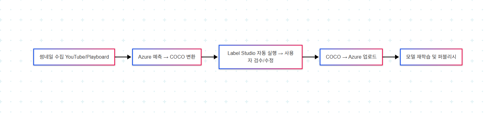

# 🎯 썸네일 성공 예측기 - AI 기반 유튜브 썸네일 분석 및 반자동 학습 파이프라인

> 유튜브 썸네일의 성공 가능성을 분석하고, Azure Custom Vision을 활용한 반자동 학습까지 지원하는 End-to-End 프로젝트입니다.

---

## 📌 주요 기능

### ✅ 1. 썸네일 수집 및 전처리
- `Youtube_Crawler.py`: 유튜브 급상승 동영상에서 썸네일 및 메타데이터 크롤링
- `Playboard_Crawler.py`: Playboard 순위 기반 썸네일 수집 (날짜별 저장)
- 중복 방지 및 파일 이름 정제 처리 포함

### ✅ 2. 반자동 라벨링 및 학습 파이프라인
- `Customvision_Predict_To_Labelstudio.py`:
  - 수집된 이미지에 대해 Azure 예측
  - COCO 및 Label Studio 포맷으로 변환
  - Label Studio 자동 실행 → **사용자가 검증 및 수정**
- `Customvision_Upload_And_Train.py`:
  - 검증된 COCO 라벨을 Azure에 업로드
  - Iteration 자동 생성, 학습 및 퍼블리시 자동화

---

## 🧩 전체 파이프라인 워크플로우


```

---

## 🧪 발표/데모용: Gradio 썸네일 분석기

- `Gradio.py`: 최종 학습된 모델을 활용한 **시각화 데모용 대시보드**
- 주요 기능:
  - 썸네일 업로드 시 객체 감지 결과 표시
  - 조회수 기여도, 트렌드 부합도, 종합 점수 시각화
  - 개선 팁 자동 제공 및 분석 리포트 다운로드
- ❗ 실제 파이프라인에는 포함되지 않으며, 발표 또는 시연용으로 사용

---

## ⚙️ 실행 방법

1. `.env` 설정
```env
AZURE_TRAINING_KEY=...
AZURE_PREDICTION_KEY=...
AZURE_TRAINING_ENDPOINT=...
AZURE_PREDICTION_ENDPOINT=...
AZURE_PREDICTION_RESOURCE_ID=...
AZURE_PREDICTION_PROJECT_ID=...
PLAYBOARD_EMAIL=...
PLAYBOARD_PASSWORD=...
```

2. 패키지 설치
```bash
pip install -r requirements.txt
```

3. 실행 예시
```bash
# 썸네일 수집
python Youtube_Crawler.py
python Playboard_Crawler.py

# 예측 → COCO 변환 → Label Studio 실행
python Customvision_Predict_To_Labelstudio.py

# Label Studio에서 검수 및 수정 후 → CustomVision 업로드 및 학습
python Customvision_Upload_And_Train.py

# (선택) 발표용 Gradio 대시보드
python Gradio.py
```

---

## 📁 프로젝트 구조

```
📦 project-root
├── data/ # 썸네일 이미지 저장
│ ├── Youtube_Trending/
│ └── playboard_thumbnails/
│
├── Label_results/ # Label Studio에서 작업한 JSON 결과
│ └── *.json
│
├── scripts/ # 실행 스크립트 및 설정
│ ├── Gradio.py
│ ├── Youtube_Crawler.py
│ ├── Playboard_Crawler.py
│ ├── Customvision_Predict_To_Labelstudio.py
│ ├── Customvision_Upload_And_Train.py
│ └── .env 🔒 (추적 제외해야 함)
│
├── requirements.txt
├── .gitignore
├── terms.html
└── README.md
```

---

## 📃 라이선스

MIT License
